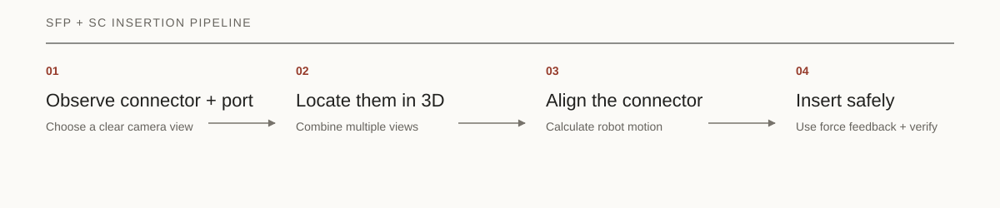
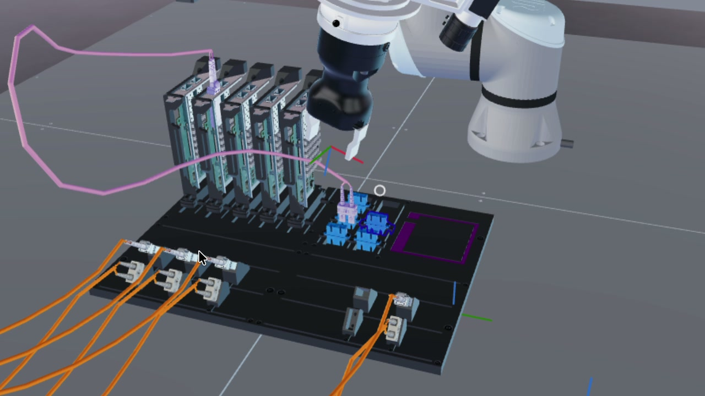

<p class="eyebrow">AI FOR INDUSTRY CHALLENGE · SFP + SC INSERTION</p>

# Intrinsic - AI for Industry Challenge

<p class="lede">Plugging a connector into a port is effortless for a person. For a robot, it means locating two small objects, aligning them within tight tolerances, and responding safely when they make contact.</p>

For the [Intrinsic - AI for Industry Challenge](https://www.intrinsic.ai/events/ai-for-industry-challenge),
our robot had to insert small form-factor pluggable (SFP) networking modules
into network interface card (NIC) ports, and SC fiber-optic plugs into optical
adapters. It performed these insertions using three wrist-mounted cameras and
a sensor that measures contact forces.

We built a ROS 2 system that combines vision with force feedback. The cameras
locate the held connector and its destination in three-dimensional space. The
robot then aligns the connector, moves it toward the port, and uses its force
sensor to guide the final insertion without applying unsafe pressure.

The neural networks do not control the robot directly. Instead, they mark
recognizable points on the connector and port in ordinary camera images.
Measurements from several views are combined to reconstruct their positions
and orientations in 3D. The system also measures how the connector sits in the
gripper, allowing it to calculate how the robot must move to place the tip at
the desired position.

<div class="link-row">
  <a href="https://github.com/AMMistry18/aic">Project repository →</a>
  <a href="https://github.com/intrinsic-dev/aic">Upstream toolkit →</a>
</div>



## How the system works

Every insertion follows the same four stages:

1. **Find a clear view.** Position the wrist cameras so the connector and port
   can be measured reliably.
2. **Locate the connector and port.** Combine landmarks from multiple camera
   views to estimate their positions in 3D.
3. **Align the connector.** Account for how it sits in the gripper and
   calculate the required robot motion.
4. **Insert safely.** Guide it into the port using visual alignment and force
   feedback.

The same pipeline handles both SFP and SC connectors, with separate dimensions,
landmarks, insertion depths, and recovery settings.

## 1. Find a useful view

The board and rail-mounted targets can move between trials, so the cameras
cannot rely on one fixed observation pose. More importantly, a view that shows
the board is not necessarily a view from which a small plug or recessed port
can be measured accurately. The survey therefore solves two separate problems:
locate the board, then choose a useful view of the requested connector sector.

First, a wrist camera detects the corners of a known board landmark. Planar PnP
uses those 2D corners and their known physical locations to recover the board's
position and orientation. A rectangle alone has multiple plausible corner
assignments, so the landmark includes an asymmetric colored shape whose
centroid selects the correct orientation. Degenerate detections, excessive
reprojection error, and inconsistent orientation hypotheses are rejected. The
result is a board coordinate frame that translates and rotates with the real
board.

The planner then describes the requested sector in that board frame and runs a
bounded geometric search:

1. Generate candidate camera poses across several standoffs, lateral offsets,
   and wrist rotations.
2. Project the entire target sector into each calibrated wrist camera.
3. Reject candidates that clip the sector, place the gripper or arm over useful
   pixels, lack a reachable robot configuration, or violate clearance limits.
4. For recessed ports, also reject views whose rays cannot see far enough into
   the opening to produce a depth cue.
5. Rank the remaining poses by image scale, usable margin, view quality, and
   required robot motion.

The geometry changes with the target, so the best camera pose does too:

| Survey target | Preferred view | Why |
| --- | --- | --- |
| Staged SFP modules | Centered, near-overhead view of the module strip | Keeps every possible pickup location visible and separates neighboring modules. |
| NIC SFP ports | Near-axial view with enough standoff for the full port span | Looks into the long recessed cages instead of seeing flat entrance rectangles. |
| SC adapters | Controlled oblique view across the adapter's long face | Reveals interior depth while avoiding along-rail foreshortening and neighbor occlusion. |

This target-specific search was more reliable than asking one nominal camera
pose to serve every detector. It also avoids treating framing as sufficient: a
port can be fully inside an image while its near wall hides the interior that
the pose estimator needs.

This stage only chooses where to observe from. It does not guess the insertion
coordinates; those come from the plug and port measurements that follow.

## 2. Build the plug and port frames

Perception has a narrow responsibility: return a 3D frame for the held plug tip
and another for the port mouth. The networks locate image landmarks; calibrated
geometry turns those landmarks into physical poses.

### From image keypoints to a 3D plug pose

Rather than asking a network to regress a robot pose directly, each connector
model predicts eight ordered landmarks whose locations are known in the plug's
tip frame. The points form two rectangles at different depths: a 12.8 × 7.6 ×
18.0 mm shape for SFP and a 20.0 × 6.4 × 12.0 mm shape for SC. This non-planar
layout makes all six pose degrees of freedom observable. It also means the
fitted origin is already the insertion tip and local +Z is the insertion axis.

The model runs on synchronized wrist-camera images. For each landmark, a
confidence-weighted Direct Linear Transform triangulates a 3D position from at
least two views. At least six of the eight landmarks must survive. A weighted
rigid fit then aligns the known connector shape to those measurements, and the
result is projected back into every source image. Stale timing, poor shape
agreement, or excessive reprojection error rejects the pose before motion.

### Why SC needed a second look

Full-frame SC inference appeared healthy: median keypoint error was only 1.47
pixels and every evaluated image group returned a pose. Yet median 3D
tip-position error was 0.4562 mm, missing our 0.4 mm working target. Signed
error analysis showed that all eight landmarks were predicted about 1.05
pixels high on average. Multiview geometry can average independent noise, but
it cannot remove a bias shared by every camera.

Our fix was a detect–crop–measure-again pass. The first detection defines a
square crop from the native-resolution image. Its side is six times the box's
longer dimension. The **same model** runs again at 960-pixel input resolution,
giving the small SC plug far more of the model's pixel budget. The refined
points return to full-image coordinates with a simple translation:

```text
full_image_keypoint = crop_keypoint + crop_top_left
```

Because the crop comes directly from the native image, no extra scale
conversion is needed. If the second pass misses, the full-frame detection stays
available.

Crop size mattered. Tight crops pushed the plug outside the scale range seen in
training and caused most or all pose groups to disappear. Loose crops became a
silent no-op. A sweep found a stable range from four to eight times the box
size; six sat in the middle and produced the best measured result.

The extra pass reduced SC median 3D position error from 0.4562 mm to 0.2633 mm
on the test split, a 42% reduction. The untouched validation split measured
0.2733 mm. This moved SC perception from missing its working target to meeting
it without a new network architecture. SFP remains full-frame because we did
not have an equivalent ablation showing that cropping improved it.

### Measuring the target port

The port models use landmarks matched to their physical openings. SFP fits a
known rectangle to at least three triangulated slot corners. SC fits the mouth
plane from four corners and uses a separately predicted center as the motion
target. Both combine repeated observations and select the candidate nearest the
measured plug, with a distance gate that prevents motion toward the wrong port.

## 3. Turn the frames into a robot target

The plug can sit slightly differently in the gripper on every attempt, so a
fixed gripper offset is not accurate enough. After measuring the held plug, the
controller records its transform from the current TCP pose:

```text
T_tcp_tip = inverse(T_world_tcp) × T_world_tip
```

This transform belongs to the current grasp. Once cached, it lets the
controller track the tip from robot kinematics even when the cameras become
occluded near the port.

The port frame supplies a center and an inward axis. The controller expresses
lateral, depth, and angular error in that frame, constructs the desired plug-tip
pose, and converts it back into a command for the TCP:

```text
T_world_tcp_target = T_world_tip_target × inverse(T_tcp_tip)
```

SFP aligns to the complete fitted port frame. SC aligns its insertion axis to
the port normal while preserving the handed-off twist about that axis, avoiding
an unnecessary rotation caused by the adapter's yaw symmetry.

Before moving, both paths reject a handoff more than 120 mm from the perceived
mouth. SC also stops if the estimate says the plug is already more than 2 mm
inside a port it has not entered.

## 4. Align, seat, verify, and recover

A valid target pose starts the insertion; it does not complete it. The final
controller is a guarded state machine with a clear responsibility in each
phase:

| Phase | Controller behavior |
| --- | --- |
| **Measure** | Capture fresh plug and port poses, compute the current grasp transform, baseline the force-torque sensor, and validate the handoff. |
| **Align** | Remain outside the mouth while removing lateral and angular error with bounded Cartesian steps. |
| **Approach** | Advance along the measured port axis at free-space speed. Slow down when contact is detected. |
| **Seat** | Track an absolute depth target while filtered force and torque feedback applies small lateral and tilt corrections. |
| **Verify** | Require a new physical insertion event. Finishing a motion command alone is not success. |
| **Recover** | Unload contact, refresh perception, retry, or start a connector-specific local search. |

The state transitions are shared, but the limits reflect each connector:

| Control parameter | SFP | SC |
| --- | ---: | ---: |
| Alignment tolerance | 1.0 mm, 1.5° | 0.3 mm, 2.0° |
| Free / contact speed | 15 / 6 mm/s | 8 / 4 mm/s |
| Contact threshold | 3 N | 2 N |
| Seating force cap | 12 N | 7 N |
| Hard abort force | 18 N | 12 N |
| Mouth-to-seat travel | 45.8 mm | 15.64 mm |

Force is not treated as one binary switch. A small rise marks first contact;
sustained force without depth gain indicates a stall or wedge; a larger limit
causes an immediate stop. Because depth is measured from the perceived port
mouth, retries do not accumulate incremental motion error.

Recovery follows the connector geometry. SFP can unload a deep wedge and apply
a bounded force-guided micro-correction. Otherwise it retracts, refreshes both
poses, and retries. SC can also run a direction-independent Archimedean spiral
when the plug is touching the adapter but not entering. The search expands to a
2 mm radius with 0.6 mm pitch and ends on 1.5 mm of depth gain, the force limit,
or a 25-second deadline.

The full loop is therefore explicit: vision establishes where insertion should
happen, kinematics carry that estimate through occlusion, force feedback
governs contact, and a separate physical event confirms success.

<figure class="result-figure">
  
  <figcaption>SC connector seated after insertion in simulation.</figcaption>
</figure>

## What the measurements show

The two plug checkpoints perform similarly on their 2D validation sets. SC also
has a separate held-out evaluation of the complete 3D plug-pose pipeline.

| Evaluation | SFP | SC |
| --- | ---: | ---: |
| 2D pose recall | 100% | 100% |
| 2D pose mAP50–95 | 99.27% | 99.50% |
| Held-out 3D median position error | Not independently reported | 0.2733 mm |
| Held-out 3D lateral P95 error | Not independently reported | 0.3291 mm |

The board-view planner was evaluated separately: it found an accepted SC
survey pose in all 96 geometric scenarios tested. These measurements cover
keypoint detection, simulated 3D pose, and view planning. They are not an
overall hardware insertion-success rate.

The most useful lesson was that detector accuracy and insertion-relevant pose
accuracy are not the same thing. The 2D SC model looked strong before the 3D
evaluation exposed its shared pixel bias. Measuring the complete perception
chain—not just the network—led directly to the crop-refinement fix.

## Why learned insertion was retired

We investigated a teacher–student residual policy for the last inch, but
contact-model parity and hardware transfer remained unresolved while the
geometric controllers provided measurable pose checks, explicit force limits,
replayable traces, and a physical success signal. We retired the learned
insertion branch; neither final connector path depends on RL.

## Code and evidence

Full conditions for the SC measurements are in the
[SC 3D pose evaluation](https://github.com/AMMistry18/aic/blob/main/docs/SC_PLUG_POSE_RESULTS.md).
The repository does not contain an equivalent completed SFP 3D report, so the
millimeter-level claims above remain specific to SC.

| Area | Repository location |
| --- | --- |
| SFP insertion controller | [`sfp_controller.py`](https://github.com/AMMistry18/aic/blob/main/aic_model/aic_model/insertion/sfp_controller.py) |
| SC insertion controller | [`sc_controller.py`](https://github.com/AMMistry18/aic/blob/main/aic_model/aic_model/insertion/sc_controller.py) |
| Shared multiview plug estimator | [`sfp_plug_pose.py`](https://github.com/AMMistry18/aic/blob/main/aic_model/aic_model/insertion/sfp_plug_pose.py) |
| Connector keypoint geometry | [`sfp_plug_pose_geometry.py`](https://github.com/AMMistry18/aic/blob/main/aic_model/aic_model/insertion/sfp_plug_pose_geometry.py) and [`sc_plug_pose_geometry.py`](https://github.com/AMMistry18/aic/blob/main/aic_model/aic_model/insertion/sc_plug_pose_geometry.py) |
| Measured SC 3D results | [`docs/SC_PLUG_POSE_RESULTS.md`](https://github.com/AMMistry18/aic/blob/main/docs/SC_PLUG_POSE_RESULTS.md) |

---

<p class="footer-note">Participant project for the AI for Industry Challenge. The challenge and upstream toolkit are by Intrinsic and Open Robotics.</p>
